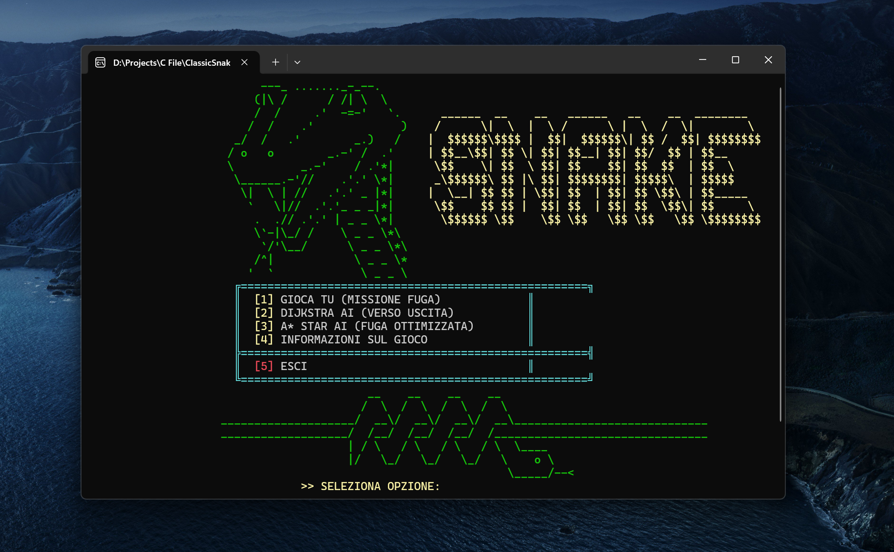
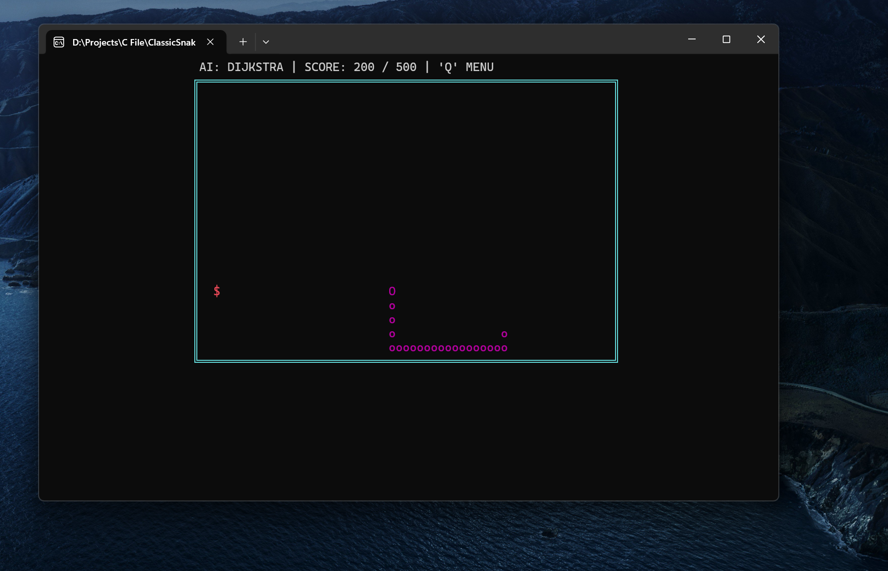

<div align="center">

#  &nbsp; AlgorithmSnake &nbsp; 

<p align="center"><i>classic-snake mission with ai pathfinding</i></p>

<br>

[](https://en.wikipedia.org/wiki/C_(programming_language))
[](https://www.microsoft.com/windows)
[](https://opensource.org/licenses/MIT)


<p align="center">
   &nbsp;&nbsp;&nbsp;
   &nbsp;&nbsp;&nbsp;
   &nbsp;&nbsp;&nbsp;
   &nbsp;&nbsp;&nbsp;
   &nbsp;&nbsp;&nbsp;
   &nbsp;&nbsp;&nbsp;
   &nbsp;&nbsp;&nbsp;
  
</p>

</div>

<div align="center">
   
  
</div>

### Project Overview
**AlgorithmSnake** is an implementation of the Snake game developed in C. Unlike standard versions, this project integrates pathfinding engines and dynamic management of the Windows terminal video buffer.

<br><br>

## Algorithmic Implementation
The core of the project lies in the Artificial Intelligence module, which allows the software to solve the game grid autonomously:

* **Dijkstra's Algorithm**: Used to guarantee the identification of the shortest path in an **unweighted graph** (the game grid), treating each free cell as an adjacent node.

* **A* Algorithm (A-Star)**: Implemented to optimize calculation times. It uses a heuristic function based on **Manhattan Distance** to guide the search toward the target, drastically reducing the number of nodes explored compared to Dijkstra.
<br>

## Computational Complexity Analysis

A complexity analysis of the navigation algorithms was performed. 
The game grid is modeled as an unweighted graph where each cell represents a node.


| Algorithm | Time Complexity (Best Case) | Space Complexity | Grid Efficiency |
| :--- | :--- | :--- | :--- |
| **Dijkstra** | $O(V + E)$ | $O(V)$ | Full radial exploration. |
| **A* (A-Star)** | $O(E)$ | $O(V)$ | Optimized via heuristics. |

<br>

> **Technical Note**: 

> * $V$ represents the number of walkable cells (Vertices).
> * $E$ represents the possible connections between adjacent cells (Edges).

<br>

### Optimization Details

While **Dijkstra's** algorithm explores uniformly in all directions until it finds the target, the **A*** implementation drastically reduces the search space. 
Using **Manhattan Distance** as the heuristic function $h(n)$:
<br>
$$d(p, q) = |p.x - q.x| + |p.y - q.y|$$
<br>
The algorithm assigns priority to nodes that minimize the cost function $f(n) = g(n) + h(n)$, allowing the snake to "aim" at the food with significantly fewer iterations, saving precious CPU cycles for console rendering.

<br><br>

## Technical Features
* **Dynamic Rendering**: The system calculates the print offset in real-time via the `GetConsoleScreenBufferInfo` APIs, ensuring the interface remains centered regardless of window size.
* **Collision Management**: Advanced logic for handling snake body segments and collisions with the game field boundaries.
* **Audio System**: Uses the system `Beep` function synchronized with game events (collisions and scoring).

<br><br>

## 🎮 Operating Modes
1. **User Mode**: Manual control via asynchronous keyboard input. The goal is to reach 500 points to unlock the side exit.
2. **AI Mode**: Automatic navigation via pathfinding. Observe the efficiency of the algorithms in managing limited space as the body length increases.

<br><br>

## Installation and Compilation

* **Operating System**: Windows (uses `windows.h` and `conio.h` APIs).
* **Compiler**: GCC (MinGW recommended).
* **Terminal Encoding**: Support for extended characters (Code Page 437).

1. Clone the repository:
    ```bash
    git clone [https://github.com/Vor7reX/AlgorithmSnake](https://github.com/Vor7reX/AlgorithmSnake)
    cd AlgorithmSnake
    ```
2. Compile the source:
    ```bash
    gcc snake_win.c -o snake_win.exe
    ```
3. Run the game:
    ```bash
    ./snake_win.exe
    ```
<br><br>

## Architecture and Components

The system adopts a modular approach to strictly separate state management (**Logic**), advanced path calculation (**AI**), and low-level video output (**Rendering**).

| Module | Function | Technical Description |
| :--- | :--- | :--- |
| **State** | `setup_round()` | Handles state registry initialization, configures the `snake[]` vector, and procedural food spawning. |
| **Logic** | `logic()` | Core of the **Game Loop**: manages spatial updates, 3-level collision detection, and unlocking the `exit_door`. |
| **AI** | `get_ai_direction()` | Graph navigation engine. Implements **BFS (Dijkstra)** for standard pathfinding and **A*** for optimized search. |
| **Math** | `get_dist()` | Calculates **Manhattan Distance**: $d(p, q) = |x_1 - x_2| + |y_1 - y_2|$. Key input for the $h$ cost in A*. |
| **Setup** | `update_offset()` | Queries `GetConsoleScreenBufferInfo` for real-time dynamic playground centering. |
| **Render** | `gotoxy()` | Wrapper for `SetConsoleCursorPosition`. Performs non-destructive rendering to eliminate console flickering. |
| **Visual** | `set_color()` | Manages Windows console Handles for mapping color attributes to ASCII glyphs. |

<br><br>
------

<div align="left">
  <p valign="middle">
    Created by <b>Vor7reX</b> 
    <a href="https://pokemondb.net/pokedex/gengar">
      
    </a>
  </p>
</div>